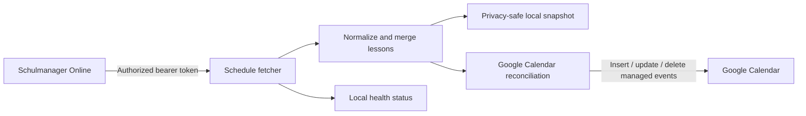

<div align="center">

# 🗓️ Schulmanager Calendar Sync

**Keep a Schulmanager Online timetable in sync with Google Calendar — automatically, privately, and self-hosted.**

[English](README.md) · [Deutsch](docs/README.de.md) · [Русский](docs/README.ru.md)

[](https://github.com/egore4606/schulmanager-calendar-sync/actions/workflows/ci.yml)
[](https://github.com/egore4606/schulmanager-calendar-sync/actions/workflows/codeql.yml)
[](https://github.com/egore4606/schulmanager-calendar-sync/actions/workflows/publish-container.yml)
[](https://github.com/egore4606/schulmanager-calendar-sync/releases)
[](https://github.com/egore4606/schulmanager-calendar-sync/pkgs/container/schulmanager-calendar-sync)
[](LICENSE)

</div>

> [!IMPORTANT]
> This is an unofficial community project and is not affiliated with Schulmanager Online or Google. Use it only with an account and calendar you are authorized to access. Schulmanager does not provide a documented public timetable API, so upstream changes may require maintenance.

## What it does

The service polls a rolling timetable window, converts lessons into stable calendar events, and reconciles those events with a Google Calendar. Repeated syncs update only what changed and remove only events previously created by this project.

| Capability | Behavior |
| --- | --- |
| 🔄 Continuous sync | Runs immediately and then at a configurable interval |
| 🧭 Timezone aware | Handles Europe/Berlin daylight-saving transitions |
| 🧩 Stable events | Inserts, updates, skips, and removes events deterministically |
| 🏫 Lesson changes | Supports substitutions, special lessons, rooms, teachers, and cancellations |
| 🎨 Custom titles | Supports title templates, per-subject emoji icons, and optional cancelled-title strikethrough |
| 🔐 Local secrets | Tokens and service-account credentials stay in `.env` and `data/` |
| 🩺 Health checks | Exposes a minimal local `/health` endpoint without calendar identifiers |
| 🐳 Self-hosted | Runs as an unprivileged, read-only Docker container |



## Quick start with Docker Compose

### 1. Prepare the project

```bash
git clone https://github.com/egore4606/schulmanager-calendar-sync.git
cd schulmanager-calendar-sync
cp .env.example .env
mkdir -p data
chmod 600 .env
```

### 2. Add credentials

Edit `.env` and provide a current `SCHULMANAGER_TOKEN`. Never paste the token into an issue, log excerpt, screenshot, or commit.

For Google Calendar synchronization:

1. Create a Google Cloud service account and enable the Google Calendar API.
2. Save its JSON key as `data/google-service-account.json`.
   Restrict access to the host account and container user that run this service; do not make the key world-readable.
3. Share the target Google Calendar with the service account's `client_email` and grant permission to edit events.
4. Set `GOOGLE_CALENDAR_SYNC_ENABLED=true` and `GOOGLE_CALENDAR_ID` in `.env`.

See the [configuration reference](docs/CONFIGURATION.md) for every variable and the [privacy guide](docs/PRIVACY.md) before the first production run.

### 3. Start the service

```bash
docker compose up -d --build
docker compose logs -f schulmanager-calendar
```

Check its local status:

```bash
curl -i http://127.0.0.1:8080/health
```

The Compose file binds the health endpoint to loopback only. Do not expose it publicly without an authenticated reverse proxy.

## Pre-built container

Tagged releases and `main` are published to GitHub Container Registry:

```bash
docker pull ghcr.io/egore4606/schulmanager-calendar-sync:latest
cp docker-compose.ghcr.yml docker-compose.yml
docker compose up -d
```

For predictable deployments, pin a release such as `v0.1.0` instead of `latest`.

## How events are managed

- The default window covers two weeks in the past and two weeks ahead, aligned to complete school weeks.
- Adjacent identical lessons are merged into a single event unless disabled.
- Google event IDs are derived from stable Schulmanager lesson identifiers.
- Only events marked `managedBy=schulmanager-calendar-sync` are reconciled or removed.
- A managed event deleted outside the service is restored on the next sync instead of aborting the run.
- Cancelled lessons are excluded by default.
- Normalized snapshots deliberately omit raw Schulmanager response objects.

## Configuration

The most common settings are:

| Variable | Default | Purpose |
| --- | --- | --- |
| `SCHULMANAGER_TOKEN` | required | Authorized Schulmanager bearer token |
| `SCHULMANAGER_STUDENT_ID` | auto-detected | Choose a child on a parent account, or override failed discovery |
| `SCHULMANAGER_TIMEZONE` | `Europe/Berlin` | Timetable timezone |
| `SYNC_INTERVAL_MINUTES` | `30` | Polling interval |
| `SYNC_PAST_WEEKS` | `2` | Completed weeks retained behind today |
| `SYNC_FUTURE_WEEKS` | `2` | Weeks synchronized ahead |
| `GOOGLE_CALENDAR_SYNC_ENABLED` | `false` | Enable Google Calendar writes |
| `GOOGLE_CALENDAR_ID` | empty | Calendar to manage |
| `GOOGLE_SERVICE_ACCOUNT_KEY_FILE` | `/data/google-service-account.json` | Mounted credentials file |
| `GOOGLE_CALENDAR_TITLE_TEMPLATE` | `({location}) {icon} {summary}` | Customize event titles |
| `GOOGLE_CALENDAR_STRIKETHROUGH_CANCELLED` | `false` | Visually mark included cancelled lessons |
| `GOOGLE_CALENDAR_SUBJECT_ICONS_FILE` | `${DATA_DIR}/subject-icons.json` | Customize per-subject emoji icons |

Full details: [docs/CONFIGURATION.md](docs/CONFIGURATION.md).

## Data and security

Runtime state lives under `data/` and is excluded from Git and Docker build contexts:

- `google-service-account.json` — private Google key;
- `token-store.json` — refreshed Schulmanager token;
- `schedule.json` — privacy-reduced normalized timetable snapshot;
- `status.json` — last successful synchronization status.
- `subject-icons.json` — editable subject-to-emoji mapping created on first use.

Back up runtime data securely, restrict filesystem access, and rotate credentials immediately if they are exposed. Vulnerabilities should be reported privately according to [SECURITY.md](SECURITY.md).

## Development

The project uses only Node.js built-ins; there are no runtime npm dependencies.

```bash
npm run verify
```

This runs syntax checks and the Node test suite. CI also builds the production container for every pull request.

Read [CONTRIBUTING.md](CONTRIBUTING.md) before proposing a change. Operational deployment and rollback guidance lives in [docs/OPERATIONS.md](docs/OPERATIONS.md).

## Limitations

- A Schulmanager bearer token can expire and may need to be refreshed.
- Automatic bundle-version discovery depends on same-origin Schulmanager web assets; set `SCHULMANAGER_BUNDLE_VERSION` explicitly if the upstream site moves them to another origin.
- The service intentionally has no browser UI and no credential-management interface.
- Google Calendar changes made manually to managed events may be overwritten, and deleted managed events may be restored, on the next sync.

## Contributors

<a href="https://github.com/egore4606/schulmanager-calendar-sync/graphs/contributors">
  
</a>

## Star history

[](https://star-history.com/#egore4606/schulmanager-calendar-sync&Date)

## License

Released under the [MIT License](LICENSE).
